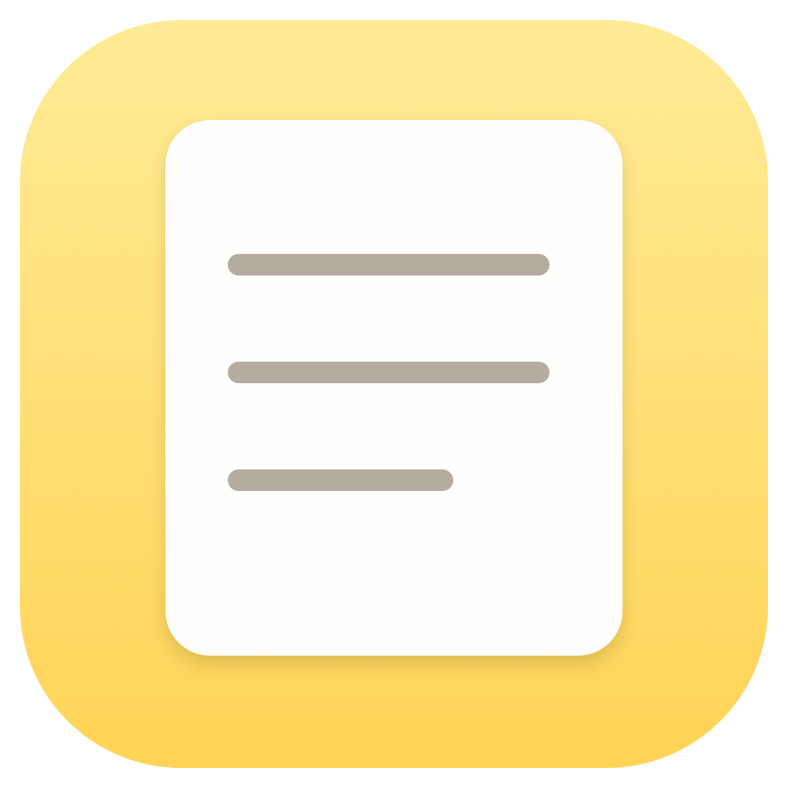
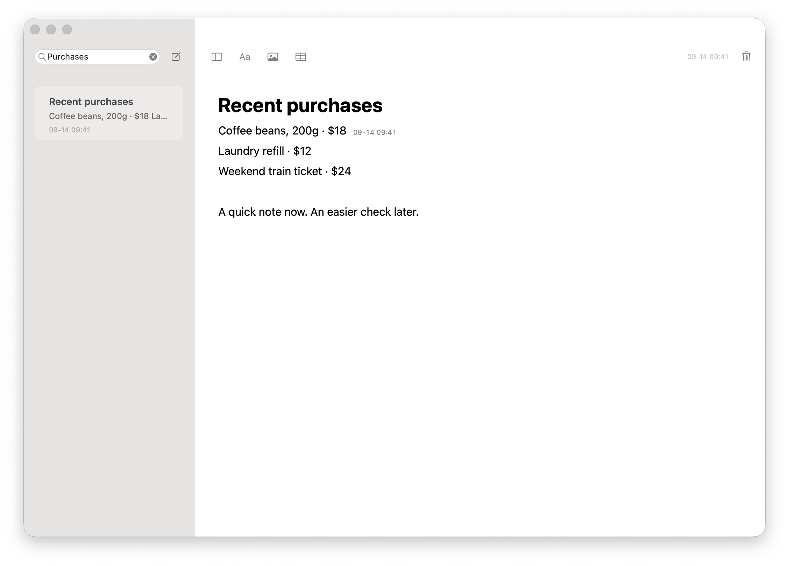

[简体中文](README.md) · **English**

<p align="center"></p>
<h1 align="center">SwiftNote</h1>
<p align="center">A thought, a note. Nothing in the way.</p>
<p align="center"><a href="https://github.com/flaricy/SwiftNote/releases/download/v1.0.0/SwiftNote-1.0.0-macOS-arm64.zip"><b>↓ Download for macOS</b></a> · <a href="https://flaricy.github.io/SwiftNote/en.html">Website ↗</a></p>
<p align="center"><sub>Apple Silicon · macOS 14+ · Free & open source · MIT</sub></p>

[](https://flaricy.github.io/SwiftNote/en.html#order-time)

### Open it. Keep your thought.

SwiftNote is a small native macOS memo app. Open straight into your last note, or start a new one from the menu bar. No home screen, workspace, or mandatory title to get through.

**Write naturally.** Type `# ` through `#### ` for headings, or `/` for lists, checklists, images, and tables. Select text to format it right where you are writing.

**Remember when you wrote it down.** Record a purchase as you place the order. Click its line later to see the latest edit time beside the text. On a full line, a small clock takes its place; hover for the complete date. Editing the line updates its time, so this is a useful clue, not a permanent order record.

**Keep the everyday things.** Paste or drop in images and resize them proportionally. Edit tables, check off tasks, search your notes, and let autosave handle the rest.

> The app’s menus are currently in Chinese; English note content is supported. Screenshots show fictional English notes in the actual app. The download is ad-hoc signed and not Apple-notarized. Read the [installation guide](docs/GUIDE.en.md#installation) before first launch.

### A few useful gestures

| To… | Use… |
| --- | --- |
| Create a note | `⌘N` or the menu bar compose button |
| Create from another app | `⌃⌥N`, while SwiftNote is running |
| Insert content | `/` on an empty line, then arrow keys and Return |
| Add one of four heading levels | `# `, `## `, `### `, `#### ` |
| Bold / italic / underline | `⌘B` / `⌘I` / `⌘U` |
| Add a checklist | `[] `; click a box to toggle it |
| Move between table cells | `Tab` / `Shift-Tab`; right-click to add or remove a row |
| Read a full edit timestamp | Click a line, then hover its time or clock |

### Small by design

Built with Swift, AppKit, and TextKit. No WebView, third-party runtime, account, network requests, or cloud sync. Notes are saved locally and can be exported as RTFD.

SwiftNote supports common Markdown input shortcuts and paste, rather than full Markdown file editing. Timestamps belong to paragraphs: wrapped lines share a time. There is no version history. Images resize with a slider; tables use native text cells.

### Build from source

Install Xcode Command Line Tools, then:

```sh
git clone https://github.com/flaricy/SwiftNote.git
cd SwiftNote
./build.sh
open 'build/随记.app'
```

Run `./test.sh` for editing and persistence checks in temporary storage. Builds default to your Mac’s architecture. The published download is arm64; Intel builds have not been tested on hardware. See [development notes](docs/DEVELOPMENT.md).

[User guide](docs/GUIDE.en.md) · [Contributing](CONTRIBUTING.md) · [Report an issue](https://github.com/flaricy/SwiftNote/issues) · [MIT](LICENSE)

Made by [flaricy](https://github.com/flaricy). Also see [Framing](https://github.com/flaricy/Framing).
