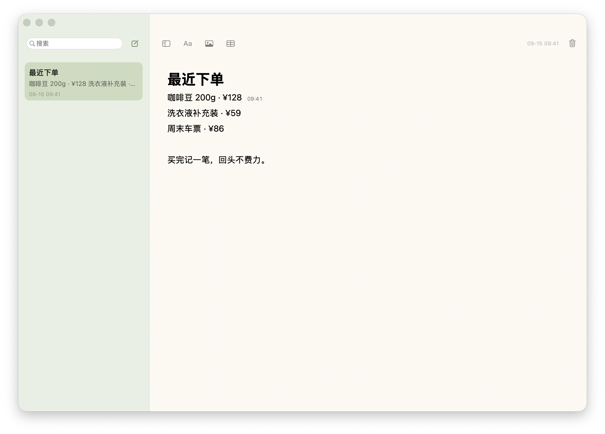

[简体中文](README.md) · [English](README.en.md)

<p align="center"></p>
<h1 align="center">SwiftNote · 随记</h1>
<p align="center">念头一闪，随手记下。<br><sub>A thought, a note. Nothing in the way.</sub></p>
<p align="center"><a href="https://github.com/flaricy/SwiftNote/releases/download/v1.0.2/SwiftNote-1.0.2-macOS-arm64.zip"><b>↓ 下载 macOS 版</b></a>　·　<a href="https://flaricy.github.io/SwiftNote/">网站 / Website ↗</a></p>
<p align="center"><sub>Apple Silicon · macOS 14+ · 免费开源 · MIT</sub></p>

[](https://flaricy.github.io/SwiftNote/)

### 打开，就回到你的思路。

随记是一个原生 macOS 备忘录。没有首页和工作区跳转，打开直接接着写。关闭窗口后，仍可从菜单栏快速新建。

**写起来顺手。** 输入 `# ` 到 `#### ` 变成标题；输入 `/` 插入标题、列表、待办、图片或表格。选中文字，就近排版。

**记账时，也留个时间线索。** 下单当时记下买了什么、花了多少，点击这一行就能查看最近修改时间。行尾太满，就用一个小钟；悬停即时显示完整日期。后续编辑会更新时间，并不会永久保留原始下单时间。

**留住日常的小事。** 图片可粘贴、拖入和等比缩放；表格可编辑、增删行；待办点一下完成。自动保存，支持搜索。

> 首次安装：当前下载包为 ad-hoc 签名，尚未经过 Apple 公证，macOS 可能阻止首次打开。请先阅读[安装说明](docs/GUIDE.md#安装)。

### 几个顺手的动作

| 想做什么 | 怎么做 |
| --- | --- |
| 新建一条 | `⌘N`，或菜单栏书写按钮 |
| 在其他应用中快速新建 | `⌃⌥N`（随记运行时） |
| 插入内容 | 空行输入 `/`，输入关键词，方向键选择、回车确认 |
| 四级标题 | `# `、`## `、`### `、`#### ` |
| 粗体 / 斜体 / 下划线 | `⌘B` / `⌘I` / `⌘U` |
| 待办 | 输入 `[] `，点击方框切换完成状态 |
| 表格换格 | `Tab` / `Shift-Tab`；右键增删行 |
| 完整修改时间 | 点击正文行，再悬停行尾时间或小钟 |

### 为一条备忘录，保持轻量。

Swift + AppKit + TextKit，无 WebView、第三方运行时或网络请求。不需要账户，也不使用云服务。数据保存在本机，可导出 RTFD。

支持常用 Markdown 快捷输入和粘贴，不是完整 Markdown 文件编辑器。修改时间按段落记录，自动折行共享时间，不提供历史版本恢复。图片缩放使用滑杆，表格使用原生文本单元格。


### 从源码构建

安装 Xcode Command Line Tools 后：

```sh
git clone https://github.com/flaricy/SwiftNote.git
cd SwiftNote
./build.sh
open 'build/随记.app'
```

`./test.sh` 在临时数据中执行编辑和持久化回归。构建默认使用当前 Mac 架构；公开下载包为 arm64，其他架构尚未实机验证。详见[开发说明](docs/DEVELOPMENT.md)。

[使用指南](docs/GUIDE.md) · [参与贡献](CONTRIBUTING.md) · [反馈问题](https://github.com/flaricy/SwiftNote/issues) · [MIT](LICENSE)

由 [flaricy](https://github.com/flaricy) 制作。也可以看看 [Framing · 拾图](https://github.com/flaricy/Framing)。
